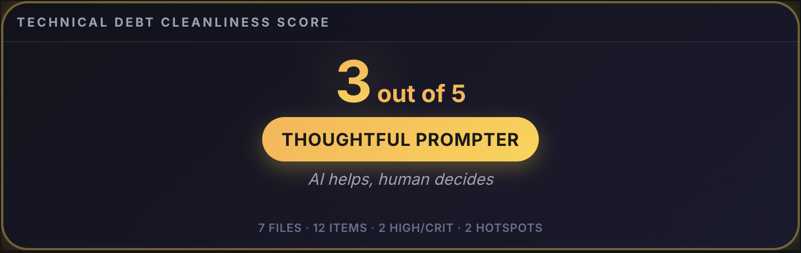
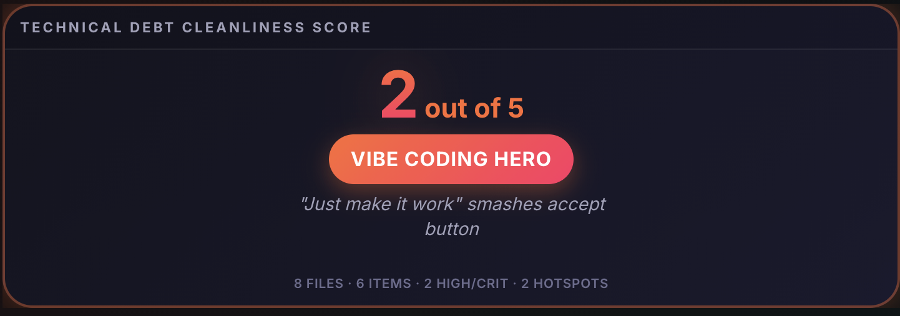
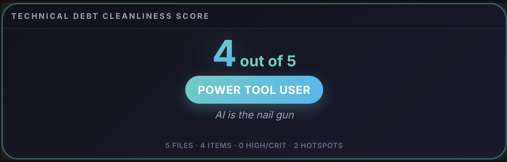
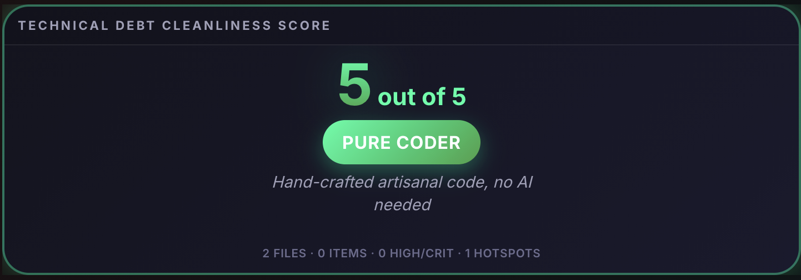

# Technical Debt Visualizer

**[tech-debt-visualizer](https://www.npmjs.com/package/tech-debt-visualizer)** on npm

Analyze a repo and get a **cleanliness score**, **debt breakdown**, and optional **AI explanations and refactor suggestions**—in the terminal or as an interactive HTML report.


### Preview

| | | | |
|:---:|:---:|:---:|:---:|
|  |  |  |  |

---

## From the get-go

**Option A — No install (run from any folder):**

```bash
npx tech-debt-visualizer analyze .
```

**Option B — Install once, then run:**

```bash
npm install -g tech-debt-visualizer
tech-debt-visualizer analyze .
```

That's the command: **`tech-debt-visualizer analyze .`** (the `.` is "this folder"). You get a terminal report: cleanliness tier (1–5), debt items, hotspots, and a "what to fix" list. No config required. Node 18+.

- **HTML report?** Add `-f html -o report.html`, then open the file.
- **No API key?** Add `--no-llm` for metrics only (no AI).

More options: run **`tech-debt-visualizer analyze --help`** (or with `npx` if you didn't install globally).

---

## How to run it

| What you want | Command |
|----------------|--------|
| **Terminal report** | `tech-debt-visualizer analyze .` (or `npx tech-debt-visualizer analyze .` if not installed) |
| **HTML report** | `tech-debt-visualizer analyze . -f html -o report.html` |
| **No AI (no API key)** | `tech-debt-visualizer analyze . --no-llm` |
| **From this repo (dev)** | `npm run build` then `npm run analyze` |

Use **`tech-debt-visualizer`** (not `tech-debt`); `npx tech-debt` is a different package.

---

## How it works

The tool runs a fixed pipeline so you know exactly what you’re getting.

1. **Discover files**  
   Walks the repo (respecting common ignores like `node_modules`, `.git`, `dist`) and collects source files by extension: `.js`, `.ts`, `.jsx`, `.tsx`, `.py`, etc.

2. **Run language analyzers**  
   Pluggable analyzers (today: JavaScript/TypeScript and Python) parse each file with **tree-sitter**, then:
   - Count **cyclomatic complexity** (if/else, loops, switch, ternaries, `&&`/`||`).
   - Count effective lines and check for **module-level docs** (JSDoc, docstrings).
   - Emit **debt items** (e.g. “High cyclomatic complexity”, “Missing documentation”, “Large file”, “TODO/FIXME/HACK/XXX markers”) with severity and confidence.

3. **Enrich with git**  
   Uses `git log` (e.g. last 90 days) to compute per-file **churn** and **commit count**. Combines that with complexity into a **hotspot score**: files that change often and are complex are treated as higher risk. A simple **debt trend** over recent commits is also derived (heuristic, not full historical analysis).

4. **Score and tier**  
   A single **debt score** (0–100) is computed from severity and confidence of all debt items. That score is mapped to a **Cleanliness tier** (1–5), e.g. “Thoughtful Prompter (3/5)” or “Pure Coder (5/5)”, shown at the top of the CLI and report.

   **How the score is calculated:** Each debt item has a severity (low=1, medium=2, high=3, critical=4) and a confidence (0–1). The score is the weighted average of (severity × confidence) across all items, scaled by 25 and capped at 100: more or worse items → higher score (worse cleanliness).

5. **Optional LLM pass**  
   If an API key is set and you don’t use `--no-llm`, the tool:
   - Asks the LLM to assess **per-file cleanliness** for each analyzed file (up to 80) with repo context for cross-file suggestions (and optionally suggest a **concrete code refactor** in a code block).
   - Asks the LLM to explain **each debt item** (why it matters, what to do) and optionally suggest a **simplified/refactored code snippet**.
   - Asks the LLM for one **overall codebase assessment** (a short paragraph) and optional **prioritized next steps** (3–5 bullets).

   Responses are parsed: prose goes into insights/assessments; any markdown code block is stored as **suggested refactor** and shown in CLI and HTML.

6. **Output**  
   Results are printed in the terminal (CLI) and/or written as **HTML** (treemap, trend chart, drill-down), **JSON**, or **Markdown** for CI or tooling.

So: **static metrics + git → score & tier → optional LLM explanations and code suggestions → your chosen output format.**

---

## Options

| Option | Meaning |
|--------|--------|
| `-f, --format` | `cli` (default), `html`, `json`, or `markdown` |
| `-o, --output` | Output file path (for html/json/markdown) |
| `--no-llm` | Skip AI insights (no API key needed) |
| `--llm-key <key>` | API key (overrides env / `.env`) |
| `--llm-model <model>` | Model name (e.g. `gemini-1.5-flash`, `gpt-4o-mini`) |
| `--ci` | CI mode: terse output; exit 1 if debt is high |

Examples:

```bash
npx tech-debt-visualizer analyze .
npx tech-debt-visualizer analyze . -f html -o report.html
npx tech-debt-visualizer analyze ./src -f json -o debt.json
npx tech-debt-visualizer analyze . --no-llm
npx tech-debt-visualizer analyze . --ci
npx tech-debt-visualizer analyze . --llm-key YOUR_KEY --llm-model gemini-1.5-flash
```

Full list: `npx tech-debt-visualizer analyze --help`

---

## LLM (optional)

The tool can call an LLM to get **explanations** and **concrete code refactor suggestions**. You only need one provider; the first one with a key wins.

**Ways to pass the API key:** (1) Put `GEMINI_API_KEY=your_key` (or `OPENAI_API_KEY`, etc.) in a **`.env` file** in the directory you run the command from (current working directory). (2) **Export** in the same shell: `export GEMINI_API_KEY=your_key`. (3) **CLI flag**: `--llm-key your_key`. You can also set **model** via `--llm-model gemini-1.5-flash` (or another model name).

| Provider | Env var(s) | Optional env |
|----------|------------|---------------|
| **OpenRouter** | `OPENROUTER_API_KEY` | `OPENROUTER_MODEL` (default: `google/gemini-2.0-flash-001`) |
| **Gemini** | `GEMINI_API_KEY` or `GOOGLE_GENAI_API_KEY` | `GEMINI_MODEL` (default: `gemini-1.5-flash`) |
| **OpenAI** | `OPENAI_API_KEY` or `ANTHROPIC_API_KEY` | `OPENAI_BASE_URL`, `OPENAI_MODEL` (default: `gpt-4o-mini`) |

With a key set, the CLI and HTML report will include:

- **Overall assessment** — One short paragraph on the codebase.
- **Per-file** — For hotspot files: short assessment and, when the LLM suggests one, a **suggested refactor** code block.
- **Per debt item** — Why it matters, what to do, and when applicable a **suggested refactor** code block (parsed from the LLM response).

Use `--no-llm` to run with no API calls.

---

## What we measure

- **Cyclomatic complexity** — Decision points in the AST (if/for/while/switch/ternary/&&/||). Higher values suggest harder testing and refactors.
- **Documentation** — Presence of module-level JSDoc or docstrings.
- **Hotspots** — Files with high git churn *and* high complexity (riskiest to change).
- **Debt trend** — Simple heuristic over recent commits (files touched); not a full historical debt metric.
- **Cleanliness tier** — Score 0–100 mapped to a 1–5 label (e.g. “Pure Coder (5/5)” for low debt).

---

## Contributing

We’d love **issues** and **contributions**.
Please read **[CONTRIBUTING.md](CONTRIBUTING.md)** before sending a pull request.

- **Bugs or confusing behavior?** Open an issue and describe what you ran and what you expected.
- **Feature ideas?** Open an issue with a short use case; we’re happy to discuss.
- **Want to add a language?** Implement the `IAnalyzer` interface in `src/analyzers/` (see `javascript.ts` / `python.ts`), register it in `src/analyzers/index.ts`, and add the right file extensions in `src/discover.ts`. PRs welcome.
- **Code or docs?** Open a PR. You must agree to our **[Contributor License Agreement (CLA)](CLA.md)** before we can merge; the PR template includes a checkbox for this.

---

## Repo layout

```
src/
  cli.ts           # Entrypoint, progress, output
  engine.ts       # Runs discovery → analyzers → git → optional LLM
  discover.ts     # File discovery by extension
  git-analyzer.ts # Churn, hotspots, trend from git log
  llm.ts          # LLM calls (OpenAI/OpenRouter/Gemini), prompts, code-block parsing
  cleanliness-score.ts  # Score → tier (1–5)
  types.ts        # DebtItem, FileMetrics, AnalysisRun, IAnalyzer
  analyzers/      # Per-language: tree-sitter parse, complexity, debt items
  reports/        # HTML, JSON, Markdown
```

---

## Publishing

To publish this package to npm: see **[docs/PUBLISHING.md](docs/PUBLISHING.md)** for step-by-step instructions (login, build, publish, scoped name if needed).

## License

**Dual licensing.**

- **GPL-3.0 (open source):** You may use, modify, and distribute this software under the [GNU General Public License v3](https://www.gnu.org/licenses/gpl-3.0.html). You must comply with the GPL (e.g., disclose source for derivatives, same license).
- **Commercial license:** If you need to use this in proprietary or commercial software without GPL obligations, a separate commercial license is available from the copyright holder. Contact the copyright holder for terms.

See [LICENSE](LICENSE) for the GPL-3.0 text and dual-licensing note.

---

*This project is an independent initiative and is not affiliated with, endorsed by, or operated by any formed legal entity.*
